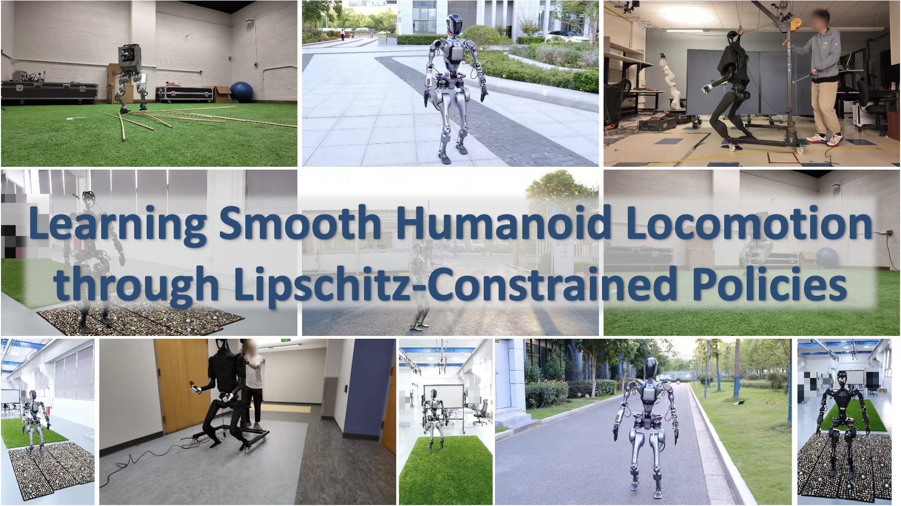

<h1 align="center">Learning Smooth Humanoid Locomotion <br> through Lipschitz-Constrained Policies</h1>


<p align="center">
    <a href="https://zixuan417.github.io/"><strong>Zixuan Chen<sup>*,1</sup></strong></a>
    |
    <a href="https://xialin-he.github.io/"><strong>Xialin He<sup>*,2</sup></strong></a>
    |
    <a href="https://wangyenjen.github.io/"><strong>Yen-Jen Wang<sup>*,3</sup></strong></a>
    |
    <a href="https://qiayuanl.netlify.app/"><strong>Qiayuan Liao<sup>3</sup></strong></a>
    |
    <a href="https://yanjieze.com/"><strong>Yanjie Ze<sup>4</sup></strong></a>
    |
    <a href="https://zyliatzju.github.io/"><strong>Zhongyu Li<sup>3</sup></strong></a>
    <br>
    <a href="https://people.eecs.berkeley.edu/~sastry/"><strong>S. Shankar Sastry<sup>3</sup></strong></a>
    |
    <a href="https://jiajunwu.com/"><strong>Jiajun Wu<sup>4</sup></strong></a>
    |
    <a href="https://me.berkeley.edu/people/koushil-sreenath/"><strong>Koushil Sreenath<sup>3</sup></strong></a>
    |
    <a href="https://saurabhg.web.illinois.edu/"><strong>Saurabh Gupta<sup>2</sup></strong></a>
    |
    <a href="https://xbpeng.github.io/"><strong>Xue Bin Peng<sup>1,5</sup></strong></a>
    <br>
    <sup>1</sup> Simon Fraser University
    &nbsp
    <sup>2</sup> UIUC
    &nbsp
    <sup>3</sup> UC Berkeley
    &nbsp
    <sup>4</sup> Stanford University
    &nbsp
    <sup>5</sup> NVIDIA
    <br>
    * Equal Contribution
</p>

<p align="center">
<h3 align="center"><a href="https://lipschitz-constrained-policy.github.io/">Website</a> | <a href="https://lipschitz-constrained-policy.github.io/">arXiv</a> | <a href="https://youtu.be/GWeI48QK6B8?si=qi0vgf1Yg4v5qbjD">Video</a> </h3>
<div align="center"></div>
</p>

<p align="center">

</p>

## Codebase Overview
This codebase supports simulation training of five different humanoid robots: **Fourier GR1T1**, **Fourier GR1T2**, **Unitree H1**, **Berkeley Humanoid**, and **Unitree G1**. The simulation training is based on **Isaac Gym**. We also provide a sim-to-sim pipeline for these robots. The sim-to-sim is performed in **Mujoco.** Please find the detailed instructions for simulation training in [simulation](./simulation/).

Our codebase currently provides the real-world deployment code of **Fourier GR1T2**. Please find the detailed instructions for real-world deployment in [deployment](./deployment/).

## Acknowledgements
+ We would like to thank all the authors in this project, this project cannot be finished without your efforts!
+ Our simulation environment implementation is based on [legged_gym](https://github.com/leggedrobotics/legged_gym), and the rl algorithm implementation is based on [rsl_rl](https://github.com/leggedrobotics/rsl_rl).
+ [Humanoid-Gym](https://github.com/roboterax/humanoid-gym) and [Expressive-Humanoid](https://github.com/chengxuxin/expressive-humanoid) also provide lots of insights.

## Citation
If you find this work useful, please consider citing:
```
@article{chen2024lcp,
title={Learning Smooth Humanoid Locomotion through Lipschitz-Constrained Policies},
author={Zixuan Chen and Xialin He and Yen-Jen Wang and Qiayuan Liao and Yanjie Ze and Zhongyu Li and S. Shankar Sastry and Jiajun Wu and Koushil Sreenath and Saurabh Gupta and Xue Bin Peng},
journal={arxiv Preprint arXiv:2410.11825},
year={2024}
}
```

